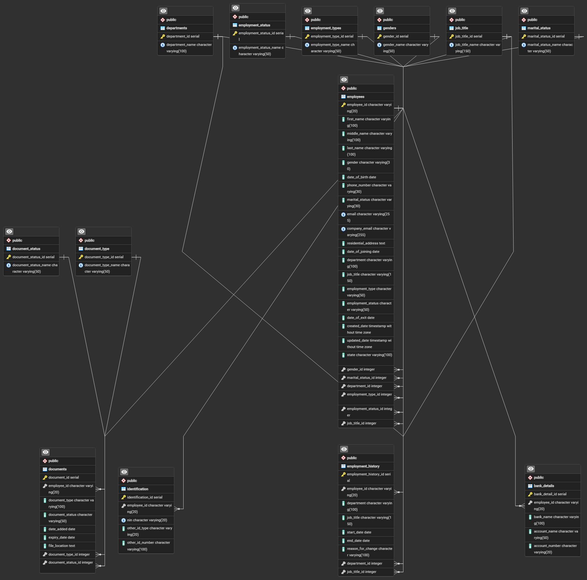

# AVANE Employee Management Database

## Overview

A relational employee management database designed and implemented using PostgreSQL and SQL.

The database was developed to organize employee information and related records, including employment details, identification, banking information, documents, and employment history.

## Project Objectives

- Design a structured relational database for employee data management
- Establish relationships between employee records and supporting information
- Apply primary keys, foreign keys, unique constraints, and validation rules
- Import and validate employee data
- Develop SQL queries for data retrieval, reporting, and analysis
- Demonstrate practical PostgreSQL and relational database design skills

## Database Structure

The database consists of 13 related tables:

| Table | Purpose |
|---|---|
| `employees` | Stores core employee information |
| `departments` | Stores department information |
| `job_title` | Stores job titles |
| `employment_types` | Stores employment types |
| `employment_status` | Stores employment statuses |
| `genders` | Stores gender reference values |
| `marital_status` | Stores marital status values |
| `identification` | Stores employee identification records |
| `bank_details` | Stores employee banking information |
| `document_type` | Stores document categories |
| `document_status` | Stores document status values |
| `documents` | Stores employee document records |
| `employment_history` | Tracks changes in employee employment information |

## Database Relationships

The database uses foreign keys to establish relationships between employee records and supporting tables.

## Key Database Features

- Relational database design
- Primary keys
- Foreign keys
- Unique constraints
- CHECK constraints
- Default values
- Identity columns
- Data validation
- Employee employment history tracking
- Document tracking
- SQL joins and aggregations

## SQL Queries

The `queries.sql` file contains tested SQL queries demonstrating:

- Employee data retrieval
- Joining related tables
- Department-level employee counts
- Employment history retrieval
- Document tracking
- Employment status analysis
- Employee identification records

## Technologies

- PostgreSQL
- SQL
- pgAdmin
- Relational Database Design

## Project Files

- `schema.sql` — Database table definitions and constraints
- `queries.sql` — SQL queries used for data retrieval and analysis
- `avane-database-erd.png` — Entity Relationship Diagram

## Data Privacy

This repository contains database structure and SQL examples for portfolio demonstration.

No real employee records, NINs, bank account numbers, personal addresses, or other confidential employee information are included.

## Skills Demonstrated

- PostgreSQL
- SQL
- Relational database design
- Database normalization concepts
- Data integrity and validation
- Foreign key relationships
- SQL joins
- Aggregation and reporting
- Data management
